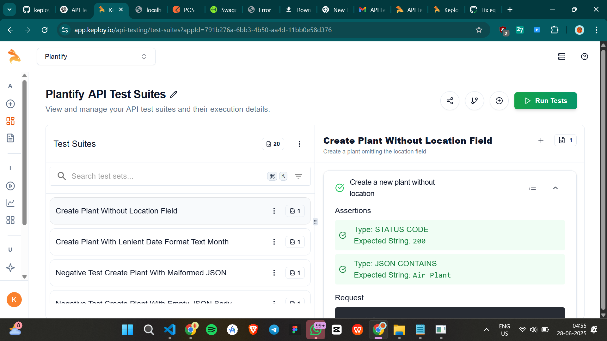

# 🌿 PlantoPlan

PlantoPlan is a Node.js API for managing plant watering schedules.

This project includes:
- Express.js backend
- PostgreSQL database
- API testing automation with [Keploy](https://keploy.io)
- Continuous Integration using GitHub Actions

---

## 🚀 Features

✅ CRUD operations for plants  
✅ OpenAPI (Swagger) documentation  
✅ AI-generated API tests with Keploy  
✅ CI/CD pipeline for automated test execution

---

## 🧪 Keploy API Test Reports

Below is a screenshot of the Keploy test reports generated for this API:


[Test Report 2](tesdrive.png)
<!-- 🔼 Replace ./cov.png with the actual path to your screenshot file -->

---

## ⚙️ CI/CD Pipeline Configuration

This project uses **GitHub Actions** to run Keploy tests automatically on every push to `main`.

You can view the workflow YAML here:

👉 [`.github/workflows/ci.yml`](https://github.com/maverickjit/plantoplan/blob/main/.github/workflows/ci.yml)
<!-- 🔼 Make sure this URL matches your repository path -->

---

## 🚦 How to Run Locally

1️⃣ Install dependencies:

```bash
npm install
